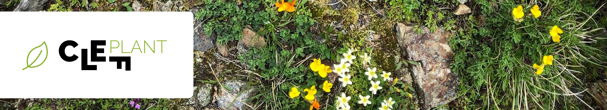

# 3rd place solution for competition "PlantCLEF2025 @ LifeCLEF & CVPR-FGVC" on Kaggle



This repository contains our code for the [2025 PlantCLEF Kaggle Challenge](https://www.kaggle.com/competitions/plantclef-2025/overview)

A paper accompanying this repository is available under the title ***"Multi-Label Plant Species Prediction with Metadata-Enhanced Multi-Head Vision Transformers"***.

Our team:
- Hanna Herasimchyk [[Homepage]](https://geranium12.github.io/)
- Robin Labryga [[Homepage]](https://robinlabryga.github.io/)
- Tomislav Prusina [[Homepage]](https://tomo61098.github.io/)

## Abstract

We present a multi-head vision transformer approach for multi-label plant species prediction in vegetation plot images, addressing the PlantCLEF 2025 challenge. The task involves training models on single-species plant images while testing on multi-species quadrat images, creating a drastic domain shift.
Our methodology leverages a pre-trained DINOv2 Vision Transformer Base (ViT-B/14) backbone with multiple classification heads for species, genus, and family prediction, utilizing taxonomic hierarchies. Key contributions include multi-scale tiling to capture plants at different scales, dynamic threshold optimization based on mean prediction length, and ensemble strategies through bagging and Hydra model architectures. The approach incorporates various inference techniques including image cropping to remove non-plant artifacts, top-n filtering for prediction constraints, and logit thresholding strategies. Experiments were conducted on approximately 1.4 million training images covering 7,806 plant species. Results demonstrate strong performance, making our submission 3rd best on the private leaderboard.

## Project Structure

- [`pipeline.py`](./pipeline.py): Main training and inference pipeline.
- [`config/`](./config/): Configuration files for the pipeline.
- [`src/`](./src/): The main source code for the project.
- [`test/`](./test/): The main test code for the project.
- [`predictions/`](./predictions/): Scripts related to prediction.
- [`submissions/`](./submissions/): Scripts related to evaluation and comparison of submissions.
- [`utils/`](./utils/): Utility scripts
- [`notebooks/`](./notebooks/): Jupyter notebooks for exploration and analysis.
- [`docs/`](./docs/): Documentation and information gathered during the project.
- [`misc/`](./misc/): Miscellaneous files and scripts.

## Usage

First, install the dependencies using uv.

```bash
pipx install uv
uv sync
```

Then, set `CUDA_VISIBLE_DEVICES` and `main_process_port` to a random free port (if you run multiple accelerate pipelines) and run the code using uv.

```bash
CUDA_VISIBLE_DEVICES=2,3 uv run accelerate launch --main_process_port=29523 pipeline.py
```

You can specify the run configuration using [`config/config.yaml`](./config/config.yaml).

## Contributing

To contribute you need to install pre-commit hooks in your git repository.

```bash
uv run pre-commit install
```

To run the pre-commit hooks manually, use the following command.

```bash
uv run pre-commit run --all-files
```

## Citation

```tex
@article{harasimchyk2025multilabel,
  title={Multi-Label Plant Species Prediction with Metadata-Enhanced Multi-Head Vision Transformers},
  author={Harasimchyk, Hanna and Labryga, Robin and Prusina, Tomislav},
  url = {https://github.com/geranium12/plant-clef-2025},
  year={2025}
}
```
<!-- TODO: Add journal -->
